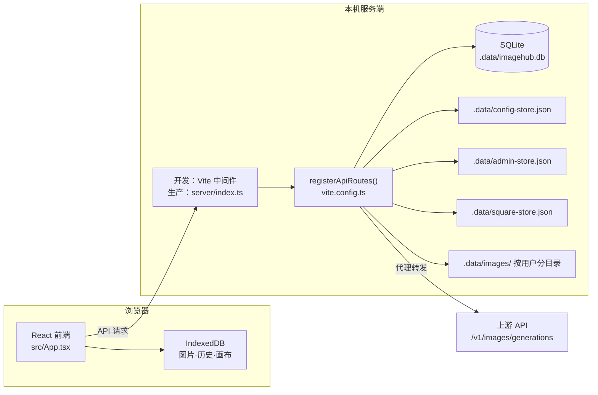

# Image Studio — 本地优先的 AI 生图工作台


> 从一句提示词，到一组可复用的视觉资产。把批量生成、无限画布、智能分析、社区广场和本地图库，放进一个安静、清晰、反应迅速的创作空间。生成的每一张图都属于你——浏览器 IndexedDB 保有完整本地副本，服务端同步落盘一份供管理后台回看，不经过任何第三方存储。


## 为什么需要 Image Studio

市面上的 AI 生图工具大多是云端 SaaS，生成结果散落在各个平台，本地无法回溯；或者是简单的 API 包装，缺少批量管理、空间化创作和团队协作的能力。

**Image Studio** 以 **local-first** 为设计原则——浏览器 IndexedDB 始终保有图片、提示词、参数和历史的完整副本，你自带上游 API Key，数据只在「你的浏览器 ↔ 你自建的服务端 ↔ 你指定的上游」之间流转，不落任何第三方平台。

## 四大功能模块

### 🎨 工作台（Studio）

全功能批量生图工作站。

- **批量生成**：一次提交 1–20 张（默认 4），1–6 路并发队列（默认 2），失败自动重试 0–5 次（默认 2）
- **多模型支持**：默认白名单为 `gpt-image-2` / `gpt-image-2-pro` / `gpt-5.4-image-2` / `gemini-3-pro-image-preview`，可在管理后台增删；前端内置 7 种生图协议适配（custom-openai / openai-images / openai-responses / gemini-native / gemini-openai / google-imagen / stability-core）
- **高分辨率尺寸**：`gpt-image-2` 与 `gpt-image-2-pro` 提供 13 个显式尺寸（9 个 2K + 4 个 4K），最长边 3840px，请求尺寸与产出像素严格一致；其余 image-2 系模型走官方固定 1K 尺寸
- **模型实测数据**：模型选择器每一项下方显示近 7 日真实成功率与 P50 耗时（样本 <3 条时不显示），数据来自本机历史请求
- **参考图上传**：最多 6 张（png/jpeg/webp，单张 ≤10MB），超过 512KB 或长边超 1536px 时自动压缩后再发送，原图保留在本地
- **智能分析**：生成前调用非生图 GPT 模型做流式预检，支持「发送前检查 / 提示词优化 / 参数推荐 / 失败预判 / 风格增强」5 种模式；无 Key 或无可用分析模型时降级为本地启发式；可在界面关闭，分析完成后 10 秒倒计时自动开跑
- **Agent 模式**：自然语言描述需求，自动识别 4 种意图（单图 / 多图批量 / 画册项目 / 画册单页精修）并编排生成策略
- **生成链路脉冲线**：每张卡片底部按真实耗时占比拆出「接收→请求上游 / 上游生成 / 图片落盘 / 返回」四段
- **图片预览与反馈**：全屏预览、参数详情、一键下载、复制提示词、👍/👎 评价、推荐到广场


### 🖼️ 无限画布（Canvas）

空间化迭代式创作工作台——参考 Lovart ChatCanvas 交互范式。

- **无限画布**：DOM + CSS transform 实现的无限二维空间，零外部画布库
- **图片即节点**：每次生成在画布上创建一个图片节点，自由拖拽排列
- **选中即优化**：选中图片后点「优化」/ 双击 / 按 `E` 进入优化模式，该图自动成为参考图，补充提示词即可生成新版本
- **迭代树可视化**：父节点→子节点用 SVG 贝塞尔曲线连接，直观展示创作演化路径
- **独立参数面板**：右侧 360px 可折叠面板，生成模式 / 优化模式自动切换
- **参考图压缩**：进入优化模式时，长边超过 1024px 的图会被压成 1024px WebP（q=0.82）；未超过则原样使用
- **浮动工具栏**：成功节点显示「优化 / 下载 / 复制提示词 / 删除」，失败节点显示「重试 / 删除」
- **视口操作**：滚轮平移，`Ctrl/Cmd + 滚轮` 以指针为锚点缩放（10%–300%），中键 / 右键 / `Space+左键` 拖拽平移
- **缩放条与小地图**：底部为「− / 滑块 / 百分比 / + / 适应全部节点」；小地图为独立浮层，默认隐藏，按 `M` 开关
- **持久化**：画布状态与节点图片分别存入 IndexedDB，关闭浏览器不丢失；重载时图片丢失的节点会标记为「图片数据丢失」，中断的生成标记为「生成中断（页面关闭）」
- **快捷键**：`Space` 拖拽 · `Ctrl/Cmd + =`/`-`/`0` 缩放与重置 · `Ctrl/Cmd + Shift + F` 适应全部 · `E` 优化 · `M` 小地图 · `Delete`/`Backspace` 删除 · `Esc` 取消选中并退出优化模式

### 🏛️ 广场（Square）

创作者作品展示与发现社区。

- **推荐到广场**：成功生成的图片一键推荐，浏览器端压成 1024px WebP 缩略图后上传（服务端单张上限 8MB）
- **多维度浏览**：最新 / 热门 / 精选 / 本周 / 本月，触底无限懒加载
- **点赞互动**：默认每日 10 次推荐、10 次点赞配额，按 API Key 的 SHA-256 哈希识别身份
- **展示位管理**：默认单 Key 最多 4 张展示位，超出自动替换最早作品
- **原图不上传**：广场只存缩略图，原图不进入广场数据

### 🛡️ 管理后台（Admin）

运维与治理仪表盘，三个标签页：

- **概览**：请求总数、成功率、P50/P95 耗时、模型使用分布、失败原因 Top、14 天日趋势、广场治理数据（头部数字与模型/错误分布只统计生图请求，分析类请求单独计数）
- **请求日志**：按状态 / 模型 / 关键词分页检索，详情含完整参数、落盘图片缩略图、链路阶段耗时，以及失败时的「完整错误内容」面板（保留上游原始错误体，专门用于排查「HTTP 200 但其实没生成」的中转站）
- **接口配置**：配置中心，三个子页——站点与模型 / 提示词与场景 / 系统设置。上游站点、模型白名单、内置预设、系统提示词、各类配额全部在线可改，每次保存递增版本号并写审计日志


## 快速开始

### 环境要求

- **Node.js >= 20**（推荐 22 LTS；`deploy.sh` 会硬性校验，`build:server` 按 node20 打包）
- 支持所选模型的上游 API Key
- `better-sqlite3` 是原生模块，`npm install` 时会现场编译

### 开发启动

```bash
git clone https://github.com/d100000/ImageHub.git
cd ImageHub
npm install
npm run dev
```

打开 http://localhost:8877 —— 端口硬编码在 `vite.config.ts` 且 `strictPort: true`，被占用会直接失败而不是自动换端口。

### 管理员配置

默认管理员 `admin` / `admin123456`，首次登录强制重置密码。管理后台地址 http://localhost:8877/#admin

```bash
ADMIN_USERNAME=admin ADMIN_INITIAL_PASSWORD=your-password npm run dev
```

> ⚠️ 这两个变量必须走真实环境变量，写进 `.env` **不生效**（`.env` 只有 4 个 `OAUTH_*` key 会被回填到 `process.env`），且仅在首次创建 `.data/admin-store.json` 时生效。

## 生产部署

后端不依赖 Vite dev server：`registerApiRoutes(app)` 是所有 `/api/*` 路由的唯一实现，开发态挂在 Vite 中间件上，生产态由 `server/index.ts` 挂在原生 Node http 上并同时托管 `dist/`。

### 一键部署

```bash
./deploy.sh
```

流程：校验 Node 版本 → 生成 `.env` 模板（已存在则保留）→ 安装依赖 → `npm run build` + `npm run build:server` → 停旧进程 → 启动并 `curl /healthz` 健康检查 → 打印 Nginx 反代示例。

其余子命令：`./deploy.sh start|stop|restart|status|systemd`。`sudo ./deploy.sh systemd` 会写入 `/etc/systemd/system/imagehub.service`（`Restart=always`）并 enable。

### 手动构建

```bash
npm run build         # tsc -b + vite build（TypeScript 检查在这里）
npm run build:server  # esbuild 打包 server/index.ts → server-dist/index.mjs
npm run start         # node server-dist/index.mjs，PORT 环境变量可覆盖默认 8877
```

> `build:server` 对 `better-sqlite3` / `vite` / `@vitejs/plugin-react` 做了 external，产物**不是自包含**的——生产机必须保留 `node_modules`，不能只拷 `dist/` + `server-dist/`。

生产宿主还提供：`GET /healthz` 健康检查、SPA hash 路由回退、三档缓存策略（`index.html` 与 `build-version.json` 不缓存 / `assets/` 一年 immutable / 其余 5 分钟）。

### Nginx 与 OAuth

反代需转发 `Host` 与 `X-Forwarded-Proto`——`OAUTH_REDIRECT_URI` 留空时回调地址靠这两个头自动推导。`.env` 模板包含：

```
OAUTH_CLIENT_ID=
OAUTH_CLIENT_SECRET=
OAUTH_PROVIDER_URL=https://www.taijiai.online
OAUTH_REDIRECT_URI=          # 留空则按 Host 自动推导
```

`OAUTH_CLIENT_ID` 与 `OAUTH_CLIENT_SECRET` 同时非空时才启用 OAuth 登录；启用后 provider 地址会自动加入上游站点白名单，登录用户的 API Key 由 provider 下发，生成的图片按用户名分目录存放。

## 使用流程

### 标准模式

1. 进入工作台，选择上游站点，填写 API Key（自动验证并拉取模型列表）
2. 选择模型、设置宽高比 / 分辨率 / 质量 / 张数 / 并发
3. 输入提示词，可上传参考图
4. 点击生成 → 实时进度与链路耗时 → 预览 / 下载 / 评价 / 推荐到广场

### Agent 模式

1. 开启 Agent 模式 → 输入自然语言需求
2. 系统流式分析意图：单图与单页精修自动执行；多图批量弹出任务拆解待确认
3. 画册项目会打开规划弹窗，确认页面结构与风格方向后，生成 4 张整本方案图（固定 4:3 / 2K / high），选定方向再逐页精修

### 画布模式

1. 进入画布页面，在右侧面板输入提示词
2. 点击「生成到画布」→ 图片节点出现在画布上
3. 选中图片 → 点「优化」（或双击 / 按 `E`）→ 补充提示词 → 基于参考图生成新版本
4. 反复迭代，构建视觉创作演化树

## 系统架构



**关键设计决策：**

- **全栈三文件**：前端 `src/App.tsx`（~12400 行）、后端 `vite.config.ts`（~5350 行，全部路由都在 `registerApiRoutes()` 里）、样式 `src/styles.css`（~8650 行）；`server/index.ts`（~140 行）只是生产宿主，不含业务逻辑
- **无外部依赖**：画布用原生 DOM + CSS transform，不引入 react-flow / fabric.js；生产服务器用 Node 原生 http，无 Express / Koa
- **无路由库**：URL hash（`#studio` / `#canvas` / `#square` / `#admin`）+ `activePage` 状态切换
- **无状态管理库**：纯 `useState` + `useRef`，生成队列用 ref 避免渲染抖动；画布平移缩放期间用 rAF 直写 DOM transform，手势结束才提交 state
- **IndexedDB v3**：库名 `codex-image-batch-studio`，三个 store —— `history`（生成记录，带 createdAt 索引）、`canvas-state`（单键 `current`，500ms 去抖写入）、`canvas-images`（按 nodeId 存 Blob）
- **参考图不落盘**：以 10 分钟 TTL 存在内存 Map，转成 `/api/reference-images/:id` 直链交给上游回源抓取

## 数据存储与隐私

浏览器端始终保有完整数据副本；服务端保有一份供管理后台回看与排障。**不经过任何第三方存储**。

| 数据类型 | 存储位置 | 说明 |
|---------|---------|------|
| 生成图片 Blob | 浏览器 IndexedDB | 本地图库与历史回溯 |
| 生成图片文件 | 服务端 `.data/images/<用户>/` | 按 OAuth 用户名（或 clientId）分目录，文件名为 requestId；经 `/api/images/local/<用户>/<文件>` 读取 |
| 画布节点图片 | 浏览器 IndexedDB | 画布状态本地持久化 |
| 提示词·参数·历史 | 浏览器 IndexedDB | 本地回溯 |
| 请求日志 | 服务端 SQLite `request_logs` | 提示词（≤4000 字符）、参数、上游响应、链路时间戳、落盘图片引用、错误详情；最多 5000 条，超出连同图片文件一起清理 |
| 日活统计 | 服务端 SQLite `daily_stats` | 按「日期+模型」聚合，请求首次进入终态时累加；**不受 5000 条裁剪影响，历史永久保留** |
| 图片评价 | 服务端 SQLite `image_feedback` | 每个 requestId 一条 👍/👎 |
| 上游站点·模型·预设·配额 | 服务端 `.data/config-store.json` | 配置中心，管理后台可改 |
| 管理员账号·审计日志 | 服务端 `.data/admin-store.json` | scrypt 密码哈希；审计日志保留 500 条 |
| 广场缩略图 | 服务端 `.data/square-store.json` | 用户主动推荐才上传，最长边 1024px WebP |
| API Key | 浏览器 Storage | 服务端只记录是否存在、长度、6 字符前缀与 4 字符后缀 |
| 客户端标识 | 服务端请求日志 | IP 只存 SHA-256 前 16 位；User-Agent 原文截断 500 字符 |

**绝不记录：**

- **API Key 原文** —— 日志脱敏对 `apikey` / `authorization` / `password` / `token` 等键一律替换为 `[redacted]`
- **参考图内容** —— 参考图字节只在内存中转，10 分钟 TTL 后销毁，日志里只留文件名、类型与字节数占位

**需要知情的两点：**

- 广场功能会把 `sha256(apiKey)` 的完整哈希持久化到 `.data/square-store.json`，作为配额与展示位的身份标识
- 生成失败时，完整的上游错误体会写入日志的 `errorFull` 字段（仅脱敏图片数据，上限 6 万字符），并在管理后台以红色面板展示——这是为了排查「返回 200 但实际没生成」的中转站

## API 端点

所有路由都实现在 `vite.config.ts` 的 `registerApiRoutes()` 中，开发与生产共用同一份实现。

<details>
<summary>生成与模型（公开）</summary>

```
POST /api/models                              # 读取上游可用模型列表
POST /api/images/generate                     # 生成图片（代理转发，含白名单与配额校验）
POST /api/prompt/analyze                      # 提示词分析（SSE 流式）
POST /api/agent/analyze                       # Agent 意图分析（SSE 流式）
GET  /api/reference-images/:id                # 临时参考图直链（内存 10min TTL，no-store）
GET  /api/images/local/<用户>/<文件>           # 落盘图片读取（一年 immutable 缓存）
GET  /api/config                              # 公开配置快照（仅启用项，不含系统提示词与配额）
GET  /api/model-stats                         # 近 7 日各模型成功率 / P50 / 好差评
POST /api/feedback                            # 图片评价（rating: 1 / -1 / 0 取消）
```

</details>

<details>
<summary>广场</summary>

```
GET  /api/square/feed?tab=&cursor=&limit=     # 浏览 feed（身份走 x-imagehub-api-key 请求头）
GET  /api/square/quota                        # 查询配额（同上请求头，缺失返回 401）
POST /api/square/recommend                    # 推荐图片（apiKey 放 JSON body）
POST /api/square/like                         # 点赞 / 取消（apiKey 放 JSON body）
GET  /api/square/image/:id                    # 缩略图二进制（一天 immutable 缓存）
GET  /api/square/admin/overview               # 广场概览（管理员会话）
GET  /api/square/admin/export?format=&dateKey= # 数据导出 JSON/CSV（管理员会话）
```

</details>

<details>
<summary>管理员（Cookie 会话，8 小时 TTL）</summary>

```
POST /api/admin/login                         # 登录
POST /api/admin/logout                        # 登出
GET  /api/admin/me                            # 当前会话
POST /api/admin/change-password               # 修改密码（首次登录强制）
GET  /api/admin/stats                         # 统计概览（含 14 天趋势）
GET  /api/admin/requests?q=&status=&model=&offset=&limit=   # 请求日志分页（limit 默认 50，上限 1000）
GET  /api/admin/requests/:id                  # 单条请求详情
GET  /api/admin/logs/export                   # 全量日志导出
GET  /api/admin/config                        # 读取完整配置
PUT  /api/admin/config/upstreams              # 上游站点
PUT  /api/admin/config/models                 # 模型白名单
PUT  /api/admin/config/presets                # 内置预设
PUT  /api/admin/config/system-prompts         # 系统提示词
PUT  /api/admin/config/quotas                 # 各类配额
POST /api/admin/config/reset                  # 重置某一配置分组
```

</details>

<details>
<summary>OAuth 登录（仅在配置了 client id/secret 时启用）</summary>

```
GET  /api/auth/oauth/config                   # 是否启用 + provider 信息（唯一常驻可访问的）
GET  /api/auth/oauth/login                    # 302 跳转授权页（state 10min TTL）
GET  /api/auth/oauth/callback                 # 回调，成功后 302 到 #oauth-success
GET  /api/auth/oauth/me                       # 当前登录用户（未登录返回 loggedIn:false）
POST /api/auth/oauth/logout                   # 登出（会话 24h TTL）
```

</details>

<details>
<summary>非 API</summary>

```
GET  /healthz                                 # 健康检查（仅生产宿主）
GET  /build-version.json                      # 前端版本号，客户端每 5 分钟轮询检测发版
```

</details>

## 配置与业务规则

除下表末两项外，其余均可在管理后台「接口配置」中修改，改动实时生效并写审计日志。

| 规则 | 默认值 | 可调范围 |
|------|--------|---------|
| 上游站点白名单 | 太极 AI / BobDong 两条 | 管理后台增删；允许 http/https 与裸 IP，拒绝内网、回环与云元数据地址 |
| 模型白名单 | gpt-image-2 / gpt-image-2-pro / gpt-5.4-image-2 / gemini-3-pro-image-preview | 管理后台增删，**精确匹配** id，至少保留一个启用项 |
| 单 Key 广场展示位 | 4 张 | 1–50 |
| 每日推荐配额 | 10 次 | 0–1000 |
| 每日点赞配额 | 10 次 | 0–1000 |
| 广场分页大小 | 20 条 | 1–100 |
| 每用户每日生成上限 | 0（不限） | 0–100000，按 clientId + 上海时区自然日统计，超限 HTTP 429 |
| 每用户图片磁盘上限 | 0（不限） | 0–1048576 MB，超限 HTTP 429 |
| 提示词分析 / Agent 系统提示词 | 内置默认 | 管理后台全文可改 |
| 请求日志保留 | 5000 条 | 代码常量，超出连同图片文件一起清理 |
| gpt-image-2 显式尺寸 | 13 个固定选项（9×2K + 4×4K） | 代码内置；唯一的运行时约束是最长边压回 3840px |

## 技术栈

| 技术 | 用途 |
|------|------|
| React 19 | UI 框架 |
| TypeScript `^5.7` | 类型安全（`tsc -b` 同时检查 `src/`、`server/`、`vite.config.ts`） |
| Vite 6 | 构建工具 + 开发态后端中间件宿主 |
| Node 原生 http | 生产服务端宿主，零框架 |
| better-sqlite3 `^12.11` | 请求日志 / 日活统计 / 图片评价三张表（原生模块，WAL 模式） |
| esbuild | 打包生产服务器（经 Vite 传递依赖提供） |
| lucide-react | 图标库 |
| IndexedDB | 浏览器端数据持久化 |
| CSS Custom Properties | 设计令牌与主题系统 |
| scrypt | 管理员密码哈希 |

**没有测试框架、ESLint、Prettier、Biome、pre-commit hook 或 CI** —— 类型检查的唯一入口是 `npm run build`。

## 项目结构

```
├── src/
│   ├── App.tsx           # 全部前端逻辑（~12400 行）
│   ├── main.tsx          # React 挂载入口
│   ├── styles.css        # 全局样式与设计令牌（~8650 行）
│   └── assets/           # Logo、首页截图
├── server/
│   └── index.ts          # 生产宿主：挂载 registerApiRoutes + 托管 dist/（~140 行）
├── vite.config.ts        # Vite 配置 + 全部后端路由 registerApiRoutes()（~5350 行）
├── deploy.sh             # 一键部署（deploy|start|stop|restart|status|systemd）
├── docs/
│   ├── agent-mode-brochure-prd.md    # Agent 模式产品规格
│   ├── canvas-mode-prd.md            # 画布模式产品规格
│   ├── admin-config-center-prd.md    # 配置中心产品规格
│   ├── design-refresh-prd.md         # 设计系统重构方案
│   └── screenshots/                  # README 截图
├── .data/                # 运行时数据（gitignored）
│   ├── imagehub.db       # SQLite：请求日志 / 日活统计 / 图片评价
│   ├── admin-store.json  # 管理员账号 + 审计日志
│   ├── config-store.json # 配置中心：站点、模型、预设、系统提示词、配额
│   ├── square-store.json # 广场数据
│   └── images/<用户>/    # 落盘的生成图片
├── index.html
├── tsconfig.json
└── package.json
```

## 适用场景

- 📦 电商商品图批量探索与 A/B 测试
- 📱 社媒封面、短视频封面批量生成
- 🎨 海报、场景图、人物图方向迭代
- 📐 官网头图、活动视觉、销售物料生成
- 📖 宣传画册 / 彩页初稿探索（Agent 模式）
- 🖼️ 创意迭代与视觉演化探索（画布模式）
- 👥 团队内部作品展示与提示词复用（广场）
- 🔍 多模型生图接口验证与性能对比
- 📊 生成历史回溯与失败原因排查

## 开发说明

以下内容不会提交到仓库：

```
node_modules/          # 依赖
dist/                  # 前端构建产物
server-dist/           # 生产服务器构建产物
.data/                 # 运行时数据（数据库、配置、图片）
logs/                  # 运行日志
.env / .env.local      # OAuth 等环境变量
generated_images/      # 临时生成图
screenshot-*.png       # 截图文件
*.tsbuildinfo
```

> 部署到新机器时，`server-dist/` 与 `.env` 都需要现场生成——前者执行 `npm run build:server`，后者由 `./deploy.sh` 写入模板后手动填写。

## 许可证

本项目仅供学习和内部使用。
